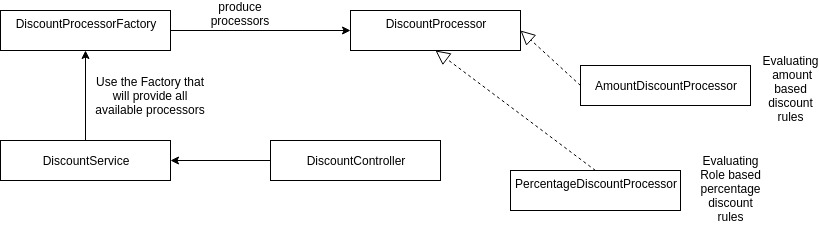
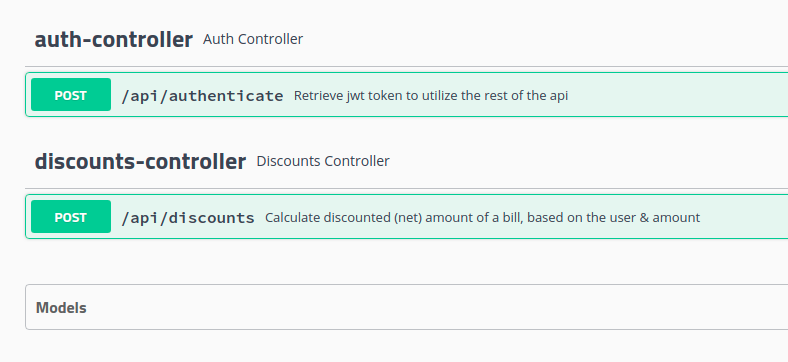

# Retail Store Discount API

### Introduction
Retail Store Discount API is a simple project that is calculating discounts for different
types of users, following specific Discount rules:
- User of type "Employee" have 30% discount on the bill
- User of type "Affiliate" have 10% discount on the bill
- User of type "Customer" (or simple user), who is registered for over 2 years, is eligible
for 5% discount on the bill
- If the order contains groceries, no percentage discount is available.
- User, who is eligible to several discounts, can take only one (with biggest percent).
- There is another type of discount which is based on amount, not on the user role, as follows:
for every 100 on the bill, there will be 5 discount, e.g. bill 990, 45 is the discount

### Main Tools
- Project is build with [Spring boot framework](https://spring.io/guides/gs/rest-service/).
- [Maven](https://maven.apache.org/guides/index.html) is used as a build tool.


### Install & Run
- Clone the repository
- go into the project folder and execute `./mvnw spring-boot:run`
- The app should be up and running on `localhost:8080`

### Implementation Tooling & Notes
To deliver project using latest technologies / approaches the following frameworks/libraries are utilized:
- Swagger - tool for documenting the API exposed - when you run the project it is available at
[http://localhost:8080/swagger-ui.html#/](http://localhost:8080/swagger-ui.html#/).
- JWT - To represent authentication in the system JWT token security approach was selected. In order to obtain token,
the client needs to do POST request with payload `{ username: 'email', 'password': 'pass'}` to this endpoint:
http://localhost:8080/api/authenticate. The system is using in-memory user base just as an example. Once app is started,
users are loaded in `InMemoryUserRepository`.
- Jacoco - framework added as maven plugin that generated test reports and test coverage.
- Spring boot starters - Web & Security starters are added to support web & auth functionality.

### Implementation Decisions
- Main domain in the system is `User`. User can have different `Roles` - CUSTOMER, AFFILIATE, EMPLOYEE.
The percentage discount engine utilize these roles to determine the eligible discount.
- There are two `Controllers` - AuthController with `/api/authenticate` endpoint, and `DiscountController` with `/api/discounts` endpoint.
- There are also two separate services - User and Discount Service.
- Only UserRepository is available to represents the user domain. This is the standard approach to utilize 3 tier
separation of concerns - Controller - Service - Repository.
- Factory Design pattern is used to hide all discount processor implementations (package visibility is applied).
- `DiscountService` retrieves all processors from the factory, and executes them one by one to generate total discount
- `PercentageDiscountProcessor` uses a certain variation of Strategy pattern where it tries to load specific discount among predefined rules.
- This architecure is really loose coupled and allows to add more processors, with variety of rules.



### Testing
There are unit tests for all Discount processors. There is also integration tests for DiscountService and DiscountController.
Tests for security and authentication are not provided for this sample demo.
To run the tests just go in the main folder and exec:
```
./mvnw clean test
```
If test report is required exec the following:
```
./mvnw clean test jacoco:report
```
The report will be generated in `/target/site/jacoco/index.html`

### API Descriptor
Swagger is available for the API at [http://localhost:8080/swagger-ui.html#/](http://localhost:8080/swagger-ui.html#/)


### Sample Data
There are several pre-defined users that can be utilized to test random application of the discount rules
Password is `secret` to all accounts.
Usernames are as follows:
```
customer@retail.com
employee@retail.com
affiliate@retail.com
customer-longterm@retail.com
employee-longterm@retail.com
affiliate-longterm@retail.com
```